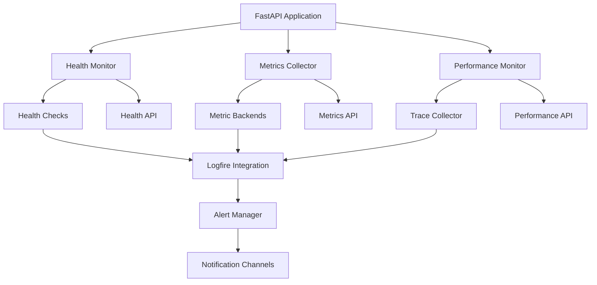

# Monitoring System Developer Guide

This guide provides comprehensive documentation for Darwin's monitoring system implementation, covering architecture, components, APIs, and extension points for developers.

## 📋 Table of Contents

1. [Architecture Overview](#architecture-overview)
2. [Core Components](#core-components)
3. [Health Monitoring](#health-monitoring)
4. [Metrics Collection](#metrics-collection)
5. [Alert Management](#alert-management)
6. [Performance Monitoring](#performance-monitoring)
7. [Distributed Tracing](#distributed-tracing)
8. [Logfire Integration](#logfire-integration)
9. [API Reference](#api-reference)
10. [Extension Points](#extension-points)
11. [Testing](#testing)
12. [Deployment](#deployment)

## 🏗️ Architecture Overview

### System Architecture

```
┌─────────────────────────────────────────────────────────────────┐
│                     Darwin Monitoring System                   │
├─────────────────────────────────────────────────────────────────┤
│                                                                 │
│  ┌─────────────────┐  ┌─────────────────┐  ┌─────────────────┐ │
│  │  Health Monitor │  │ Metrics System  │  │  Alert Manager  │ │
│  │                 │  │                 │  │                 │ │
│  │ • DB Health     │  │ • Performance   │  │ • Rule Engine   │ │
│  │ • API Health    │  │ • Custom        │  │ • Channels      │ │
│  │ • System Health │  │ • Aggregation   │  │ • Policies      │ │
│  └─────────────────┘  └─────────────────┘  └─────────────────┘ │
│           │                     │                     │         │
│           └─────────────────────┼─────────────────────┘         │
│                                 │                               │
│  ┌─────────────────────────────────────────────────────────────┐ │
│  │              Logfire Integration Layer                      │ │
│  │                                                             │ │
│  │ • Structured Logging    • Distributed Tracing              │ │
│  │ • Performance Metrics   • Error Tracking                   │ │
│  │ • Real-time Analytics   • Custom Dashboards                │ │
│  └─────────────────────────────────────────────────────────────┘ │
│                                 │                               │
│  ┌─────────────────────────────────────────────────────────────┐ │
│  │                   Storage & Processing                      │ │
│  │                                                             │ │
│  │ • Time Series Data     • Event Processing                  │ │
│  │ • Health Status Cache  • Alert State Management           │ │
│  │ • Performance History  • Trace Correlation                │ │
│  └─────────────────────────────────────────────────────────────┘ │
└─────────────────────────────────────────────────────────────────┘
```

### Component Interaction



## 🧩 Core Components

### 1. Health Monitoring (`health.py`)

The health monitoring system provides comprehensive health checking capabilities.

#### HealthChecker Class

```python
from darwin.monitoring.health import HealthChecker, HealthStatus, HealthCheckResult

class HealthChecker:
    """Main health checking coordinator"""

    def __init__(self, config: Optional[HealthConfig] = None):
        self.config = config or HealthConfig()
        self.checks: Dict[str, Callable] = {}
        self.logger = logging.getLogger(__name__)

    async def check_health(self) -> HealthReport:
        """Execute all registered health checks"""

    async def check_database_health(self) -> HealthCheckResult:
        """Check database connectivity and performance"""

    async def check_api_health(self) -> HealthCheckResult:
        """Check API endpoint availability"""

    async def check_system_resources(self) -> HealthCheckResult:
        """Check system resource usage"""
```

#### Health Check Implementation

```python
@dataclass
class HealthCheckResult:
    """Result of a health check"""
    name: str
    status: HealthStatus
    timestamp: datetime
    response_time: Optional[float] = None
    message: Optional[str] = None
    details: Optional[Dict[str, Any]] = None
    tags: Optional[Dict[str, str]] = None

class HealthStatus(Enum):
    """Health status enumeration"""
    HEALTHY = "healthy"
    DEGRADED = "degraded"
    UNHEALTHY = "unhealthy"
    UNKNOWN = "unknown"

# Example health check implementation
async def check_surrealdb_health() -> HealthCheckResult:
    """Check SurrealDB connectivity and performance"""
    start_time = time.time()

    try:
        # Test database connection
        async with get_database_session() as db:
            result = await db.query("SELECT time::now() as current_time")

        response_time = time.time() - start_time

        if response_time > 1.0:  # 1 second threshold
            return HealthCheckResult(
                name="surrealdb",
                status=HealthStatus.DEGRADED,
                response_time=response_time,
                message=f"Database responding slowly: {response_time:.2f}s"
            )

        return HealthCheckResult(
            name="surrealdb",
            status=HealthStatus.HEALTHY,
            response_time=response_time,
            message="Database is healthy"
        )

    except Exception as e:
        return HealthCheckResult(
            name="surrealdb",
            status=HealthStatus.UNHEALTHY,
            response_time=time.time() - start_time,
            message=f"Database check failed: {str(e)}"
        )
```

### 2. Metrics Collection (`metrics.py`)

The metrics system provides comprehensive performance and usage tracking.

#### MetricsCollector Class

```python
from darwin.monitoring.metrics import MetricsCollector, MetricType, MetricBackend

class MetricsCollector:
    """Central metrics collection system"""

    def __init__(self):
        self.backends: List[MetricBackend] = []
        self.counters: Dict[str, float] = {}
        self.gauges: Dict[str, float] = {}
        self.histograms: Dict[str, List[float]] = {}

    def add_backend(self, backend: MetricBackend):
        """Add a metrics backend"""

    def increment_counter(self, name: str, value: float = 1.0, tags: Optional[Dict[str, str]] = None):
        """Increment a counter metric"""

    def set_gauge(self, name: str, value: float, tags: Optional[Dict[str, str]] = None):
        """Set a gauge metric value"""

    def record_histogram(self, name: str, value: float, tags: Optional[Dict[str, str]] = None):
        """Record a histogram value"""

    @contextmanager
    def timer(self, name: str, tags: Optional[Dict[str, str]] = None):
        """Time a code block"""
```

#### Metric Types and Usage

```python
# Counter - for counting events
metrics.increment_counter("optimization.started", tags={"algorithm": "nsga2"})
metrics.increment_counter("api.requests", tags={"endpoint": "/optimize", "method": "POST"})

# Gauge - for current values
metrics.set_gauge("optimization.active_count", 5)
metrics.set_gauge("system.cpu_percent", 67.5)

# Histogram - for distributions
metrics.record_histogram("optimization.duration", 142.3, tags={"problem_type": "portfolio"})
metrics.record_histogram("api.response_time", 0.045, tags={"endpoint": "/health"})

# Timer - for measuring execution time
with metrics.timer("database.query_time", tags={"table": "optimizations"}):
    result = await db.query("SELECT * FROM optimizations")
```

### 3. Alert Management (`alerts.py`)

The alert system provides intelligent monitoring and notification capabilities.

#### AlertManager Class

```python
from darwin.monitoring.alerts import AlertManager, AlertRule, AlertCondition

class AlertManager:
    """Manages alert rules and notifications"""

    def __init__(self):
        self.rules: Dict[str, AlertRule] = {}
        self.channels: Dict[str, AlertChannel] = {}
        self.alert_state: Dict[str, AlertState] = {}

    def add_rule(self, rule: AlertRule):
        """Add an alert rule"""

    def add_channel(self, name: str, channel: AlertChannel):
        """Add a notification channel"""

    async def evaluate_rules(self):
        """Evaluate all alert rules"""

    async def send_alert(self, alert: Alert):
        """Send alert through configured channels"""
```

#### Alert Rule Definition

```python
@dataclass
class AlertRule:
    """Definition of an alert rule"""
    name: str
    condition: AlertCondition
    metric: str
    threshold: float
    duration_minutes: int
    severity: str
    message: str
    tags: Optional[Dict[str, str]] = None
    enabled: bool = True

# Example alert rules
cpu_alert = AlertRule(
    name="high_cpu_usage",
    condition=AlertCondition.GREATER_THAN,
    metric="system.cpu.percent",
    threshold=80.0,
    duration_minutes=5,
    severity="warning",
    message="CPU usage above 80% for 5 minutes"
)

optimization_failure_alert = AlertRule(
    name="optimization_failures",
    condition=AlertCondition.GREATER_THAN,
    metric="optimization.failures.rate",
    threshold=0.1,  # 10% failure rate
    duration_minutes=10,
    severity="error",
    message="High optimization failure rate detected"
)
```

### 4. Performance Monitoring (`performance.py`)

Advanced performance monitoring and analytics.

#### PerformanceMonitor Class

```python
from darwin.monitoring.performance import PerformanceMonitor, PerformanceAnalyzer

class PerformanceMonitor:
    """Monitors system and application performance"""

    def __init__(self):
        self.analyzer = PerformanceAnalyzer()
        self.collectors: List[PerformanceCollector] = []

    async def collect_performance_data(self):
        """Collect performance metrics from all sources"""

    async def analyze_performance(self) -> PerformanceReport:
        """Analyze collected performance data"""

    def get_performance_recommendations(self) -> List[PerformanceRecommendation]:
        """Get AI-powered performance recommendations"""
```

#### Performance Analysis

```python
# Performance data collection
performance_data = {
    "api_response_times": [0.123, 0.089, 0.156, 0.092],
    "optimization_durations": [142.3, 98.7, 203.1, 156.8],
    "memory_usage": [67.2, 68.1, 69.5, 71.2],
    "cpu_usage": [45.3, 52.1, 48.9, 51.7]
}

# Performance analysis
class PerformanceAnalyzer:
    def analyze_response_times(self, response_times: List[float]) -> ResponseTimeAnalysis:
        """Analyze API response time patterns"""

    def analyze_optimization_performance(self, durations: List[float]) -> OptimizationAnalysis:
        """Analyze optimization performance trends"""

    def detect_performance_anomalies(self, metrics: Dict[str, List[float]]) -> List[Anomaly]:
        """Detect performance anomalies using statistical analysis"""
```

### 5. Distributed Tracing (`tracing.py`)

Comprehensive distributed tracing implementation.

#### Tracer Integration

```python
from darwin.monitoring.tracing import DarwinTracer
import logfire

class DarwinTracer:
    """Darwin-specific distributed tracing implementation"""

    def __init__(self):
        self.logfire_configured = self._configure_logfire()

    @contextmanager
    def trace_operation(self, operation_name: str, **attributes):
        """Trace a specific operation"""
        with logfire.span(operation_name, **attributes) as span:
            yield span

    def trace_optimization(self, optimization_id: str):
        """Trace an optimization run"""
        return self.trace_operation(
            "optimization_run",
            optimization_id=optimization_id,
            service="darwin.core"
        )
```

#### Custom Instrumentation

```python
# Automatic instrumentation
@logfire.instrument("genetic_algorithm_step")
async def run_genetic_algorithm_step(population, generation):
    """Automatically traced GA step"""
    with logfire.span("selection", generation=generation):
        selected = selection_operator(population)

    with logfire.span("crossover", generation=generation):
        offspring = crossover_operator(selected)

    with logfire.span("mutation", generation=generation):
        mutated = mutation_operator(offspring)

    return mutated

# Manual instrumentation
async def optimize_portfolio(assets, constraints):
    with logfire.span("portfolio_optimization") as span:
        span.set_attribute("asset_count", len(assets))
        span.set_attribute("constraint_count", len(constraints))

        try:
            result = await run_optimization(assets, constraints)
            span.set_attribute("optimization_success", True)
            span.set_attribute("best_fitness", result.best_fitness)
            return result
        except Exception as e:
            span.set_attribute("optimization_success", False)
            span.record_exception(e)
            raise
```

## 🔧 Logfire Integration

### Configuration

```python
# Logfire configuration in monitoring/logfire_integration.py
import logfire
from darwin.core.config import get_settings

class LogfireIntegration:
    """Central Logfire integration for Darwin"""

    def __init__(self):
        self.settings = get_settings()
        self._configure_logfire()

    def _configure_logfire(self):
        """Configure Logfire with Darwin-specific settings"""
        logfire.configure(
            token=self.settings.logfire_token,
            project_name=self.settings.logfire_project_name,
            environment=self.settings.environment,
            service_name="darwin",
            service_version=self.settings.version,
            send_to_logfire=self.settings.logfire_enabled,
            console=self.settings.logfire_console_output,
            pydantic_plugin=logfire.PydanticPlugin(record="all"),
            fast_api=logfire.FastAPIInstrumentation(
                record_headers=True,
                record_query_params=True
            )
        )
```

### Structured Logging

```python
# Structured logging examples
import logfire

# Basic structured log
logfire.info(
    "Optimization started",
    optimization_id="opt_12345",
    algorithm="nsga2",
    population_size=100,
    max_generations=200
)

# Log with performance metrics
logfire.info(
    "Optimization completed",
    optimization_id="opt_12345",
    generation_count=150,
    best_fitness=0.001234,
    execution_time_seconds=45.2,
    convergence_rate=0.95
)

# Error logging with context
try:
    result = await run_optimization(problem)
except Exception as e:
    logfire.error(
        "Optimization failed",
        optimization_id="opt_12345",
        error_type=type(e).__name__,
        error_message=str(e),
        problem_dimensions=problem.dimensions,
        algorithm_config=problem.algorithm_config
    )
```

## 📡 API Reference

### Health API Endpoints

```python
# FastAPI health endpoints
from fastapi import APIRouter
from darwin.monitoring import HealthChecker

health_router = APIRouter(prefix="/health", tags=["health"])

@health_router.get("/")
async def get_health():
    """Get overall system health"""
    health_checker = HealthChecker()
    return await health_checker.check_health()

@health_router.get("/detailed")
async def get_detailed_health():
    """Get detailed health report"""
    health_checker = HealthChecker()
    return await health_checker.get_detailed_health()

@health_router.get("/database")
async def get_database_health():
    """Get database health status"""
    health_checker = HealthChecker()
    return await health_checker.check_database_health()

@health_router.get("/system")
async def get_system_health():
    """Get system resource health"""
    health_checker = HealthChecker()
    return await health_checker.check_system_resources()
```

### Metrics API Endpoints

```python
# Metrics API endpoints
from fastapi import APIRouter
from darwin.monitoring import MetricsCollector

metrics_router = APIRouter(prefix="/metrics", tags=["metrics"])

@metrics_router.get("/")
async def get_metrics():
    """Get current metrics"""
    metrics = MetricsCollector()
    return await metrics.get_current_metrics()

@metrics_router.get("/performance")
async def get_performance_metrics():
    """Get performance metrics"""
    metrics = MetricsCollector()
    return await metrics.get_performance_metrics()

@metrics_router.post("/custom")
async def record_custom_metric(metric_data: MetricData):
    """Record a custom metric"""
    metrics = MetricsCollector()
    return await metrics.record_custom_metric(metric_data)
```

### Alert API Endpoints

```python
# Alert management endpoints
from fastapi import APIRouter
from darwin.monitoring import AlertManager

alerts_router = APIRouter(prefix="/alerts", tags=["alerts"])

@alerts_router.get("/")
async def get_alerts():
    """Get current alerts"""
    alert_manager = AlertManager()
    return await alert_manager.get_active_alerts()

@alerts_router.post("/rules")
async def create_alert_rule(rule: AlertRule):
    """Create a new alert rule"""
    alert_manager = AlertManager()
    return await alert_manager.add_rule(rule)

@alerts_router.post("/test/{rule_name}")
async def test_alert_rule(rule_name: str):
    """Test an alert rule"""
    alert_manager = AlertManager()
    return await alert_manager.test_rule(rule_name)
```

## 🔌 Extension Points

### Custom Health Checks

```python
# Implementing custom health checks
from darwin.monitoring.health import HealthCheckResult, HealthStatus

async def custom_ml_model_health() -> HealthCheckResult:
    """Custom health check for ML model"""
    try:
        # Check model availability and performance
        response_time = await check_model_latency()

        if response_time > 1.0:
            return HealthCheckResult(
                name="ml_model",
                status=HealthStatus.DEGRADED,
                response_time=response_time,
                message=f"Model latency {response_time:.2f}s exceeds threshold"
            )

        return HealthCheckResult(
            name="ml_model",
            status=HealthStatus.HEALTHY,
            response_time=response_time
        )

    except Exception as e:
        return HealthCheckResult(
            name="ml_model",
            status=HealthStatus.UNHEALTHY,
            message=f"Model check failed: {str(e)}"
        )

# Register custom health check
health_checker = HealthChecker()
health_checker.register_check("ml_model", custom_ml_model_health)
```

### Custom Metrics Backends

```python
# Implementing custom metrics backends
from darwin.monitoring.metrics import MetricBackend

class PrometheusBackend(MetricBackend):
    """Send metrics to Prometheus"""

    def __init__(self, gateway_url: str):
        self.gateway_url = gateway_url

    async def send_counter(self, name: str, value: float, tags: Dict[str, str]):
        """Send counter metric to Prometheus"""
        # Implementation for Prometheus counter

    async def send_gauge(self, name: str, value: float, tags: Dict[str, str]):
        """Send gauge metric to Prometheus"""
        # Implementation for Prometheus gauge

    async def send_histogram(self, name: str, value: float, tags: Dict[str, str]):
        """Send histogram metric to Prometheus"""
        # Implementation for Prometheus histogram

class DatadogBackend(MetricBackend):
    """Send metrics to Datadog"""

    def __init__(self, api_key: str):
        self.api_key = api_key

    async def send_counter(self, name: str, value: float, tags: Dict[str, str]):
        """Send counter metric to Datadog"""
        # Implementation for Datadog counter

# Register custom backends
metrics = MetricsCollector()
metrics.add_backend(PrometheusBackend("http://prometheus:9091"))
metrics.add_backend(DatadogBackend("your_datadog_api_key"))
```

### Custom Alert Channels

```python
# Implementing custom alert channels
from darwin.monitoring.alerts import AlertChannel, Alert

class CustomWebhookChannel(AlertChannel):
    """Custom webhook alert channel"""

    def __init__(self, webhook_url: str, headers: Dict[str, str]):
        self.webhook_url = webhook_url
        self.headers = headers

    async def send_alert(self, alert: Alert):
        """Send alert via webhook"""
        payload = {
            "alert_name": alert.name,
            "severity": alert.severity,
            "message": alert.message,
            "timestamp": alert.timestamp.isoformat(),
            "tags": alert.tags
        }

        async with httpx.AsyncClient() as client:
            response = await client.post(
                self.webhook_url,
                json=payload,
                headers=self.headers
            )
            response.raise_for_status()

class PagerDutyChannel(AlertChannel):
    """PagerDuty alert channel"""

    def __init__(self, integration_key: str):
        self.integration_key = integration_key

    async def send_alert(self, alert: Alert):
        """Send alert to PagerDuty"""
        # Implementation for PagerDuty integration

# Register custom channels
alert_manager = AlertManager()
alert_manager.add_channel("webhook", CustomWebhookChannel(
    "https://your-webhook.com/alerts",
    {"Authorization": "Bearer your-token"}
))
alert_manager.add_channel("pagerduty", PagerDutyChannel("your_integration_key"))
```

## 🧪 Testing

### Testing Health Checks

```python
# tests/test_monitoring/test_health.py
import pytest
from unittest.mock import AsyncMock, patch
from darwin.monitoring.health import HealthChecker, HealthStatus

@pytest.fixture
def health_checker():
    return HealthChecker()

@pytest.mark.asyncio
async def test_database_health_check_success(health_checker):
    """Test successful database health check"""
    with patch('darwin.monitoring.health.get_database_session') as mock_session:
        mock_session.return_value.__aenter__ = AsyncMock()
        mock_session.return_value.__aexit__ = AsyncMock()

        result = await health_checker.check_database_health()

        assert result.status == HealthStatus.HEALTHY
        assert result.response_time is not None
        assert result.response_time < 1.0

@pytest.mark.asyncio
async def test_database_health_check_failure(health_checker):
    """Test database health check failure"""
    with patch('darwin.monitoring.health.get_database_session') as mock_session:
        mock_session.side_effect = Exception("Connection failed")

        result = await health_checker.check_database_health()

        assert result.status == HealthStatus.UNHEALTHY
        assert "Connection failed" in result.message

@pytest.mark.asyncio
async def test_system_health_check(health_checker):
    """Test system resource health check"""
    with patch('psutil.cpu_percent', return_value=45.0), \
         patch('psutil.virtual_memory') as mock_memory, \
         patch('psutil.disk_usage') as mock_disk:

        mock_memory.return_value.percent = 60.0
        mock_disk.return_value.percent = 70.0

        result = await health_checker.check_system_resources()

        assert result.status == HealthStatus.HEALTHY
        assert result.details['cpu_percent'] == 45.0
        assert result.details['memory_percent'] == 60.0
        assert result.details['disk_percent'] == 70.0
```

### Testing Metrics Collection

```python
# tests/test_monitoring/test_metrics.py
import pytest
from darwin.monitoring.metrics import MetricsCollector

@pytest.fixture
def metrics_collector():
    return MetricsCollector()

def test_increment_counter(metrics_collector):
    """Test counter increment"""
    metrics_collector.increment_counter("test.counter", 5.0)

    assert metrics_collector.counters["test.counter"] == 5.0

    metrics_collector.increment_counter("test.counter", 3.0)
    assert metrics_collector.counters["test.counter"] == 8.0

def test_set_gauge(metrics_collector):
    """Test gauge setting"""
    metrics_collector.set_gauge("test.gauge", 42.0)

    assert metrics_collector.gauges["test.gauge"] == 42.0

    metrics_collector.set_gauge("test.gauge", 24.0)
    assert metrics_collector.gauges["test.gauge"] == 24.0

def test_record_histogram(metrics_collector):
    """Test histogram recording"""
    values = [1.0, 2.0, 3.0, 4.0, 5.0]

    for value in values:
        metrics_collector.record_histogram("test.histogram", value)

    assert len(metrics_collector.histograms["test.histogram"]) == 5
    assert sum(metrics_collector.histograms["test.histogram"]) == 15.0
```

### Testing Alert Management

```python
# tests/test_monitoring/test_alerts.py
import pytest
from datetime import datetime, timezone
from darwin.monitoring.alerts import AlertManager, AlertRule, AlertCondition

@pytest.fixture
def alert_manager():
    return AlertManager()

@pytest.fixture
def sample_alert_rule():
    return AlertRule(
        name="test_alert",
        condition=AlertCondition.GREATER_THAN,
        metric="test.metric",
        threshold=80.0,
        duration_minutes=5,
        severity="warning",
        message="Test alert message"
    )

def test_add_alert_rule(alert_manager, sample_alert_rule):
    """Test adding alert rule"""
    alert_manager.add_rule(sample_alert_rule)

    assert "test_alert" in alert_manager.rules
    assert alert_manager.rules["test_alert"] == sample_alert_rule

@pytest.mark.asyncio
async def test_evaluate_alert_rule(alert_manager, sample_alert_rule):
    """Test alert rule evaluation"""
    alert_manager.add_rule(sample_alert_rule)

    # Mock metric value above threshold
    with patch('darwin.monitoring.alerts.get_metric_value', return_value=85.0):
        alerts = await alert_manager.evaluate_rules()

        assert len(alerts) == 1
        assert alerts[0].name == "test_alert"
        assert alerts[0].severity == "warning"
```

## 🚀 Deployment

### Production Configuration

```python
# config/monitoring.py
from pydantic import BaseSettings

class MonitoringSettings(BaseSettings):
    """Monitoring configuration settings"""

    # Health check settings
    health_check_interval: int = 30
    health_check_timeout: int = 10
    health_check_retries: int = 3

    # Metrics settings
    metrics_collection_interval: int = 15
    metrics_retention_days: int = 30
    metrics_batch_size: int = 100

    # Alert settings
    alert_evaluation_interval: int = 60
    alert_cooldown_minutes: int = 15
    alert_max_notifications_per_hour: int = 10

    # Logfire settings
    logfire_token: str = ""
    logfire_project_name: str = "darwin-production"
    logfire_environment: str = "production"
    logfire_enabled: bool = True

    # Performance monitoring
    performance_sampling_rate: float = 0.1
    trace_sampling_rate: float = 0.01
    enable_profiling: bool = False

    class Config:
        env_prefix = "MONITORING_"
        env_file = ".env"
```

### Docker Configuration

```dockerfile
# Dockerfile additions for monitoring
FROM python:3.12-slim

# Install monitoring dependencies
RUN pip install logfire prometheus-client psutil

# Copy monitoring configuration
COPY config/monitoring.py /app/config/
COPY monitoring/ /app/monitoring/

# Set monitoring environment variables
ENV MONITORING_HEALTH_CHECK_INTERVAL=30
ENV MONITORING_METRICS_COLLECTION_INTERVAL=15
ENV MONITORING_LOGFIRE_ENABLED=true

# Expose monitoring ports
EXPOSE 8000  # Main application
EXPOSE 8001  # Health check endpoint
EXPOSE 9090  # Metrics endpoint

# Health check
HEALTHCHECK --interval=30s --timeout=10s --start-period=40s --retries=3 \
    CMD curl -f http://localhost:8001/health || exit 1
```

### Kubernetes Monitoring

```yaml
# k8s/monitoring-config.yaml
apiVersion: v1
kind: ConfigMap
metadata:
  name: darwin-monitoring-config
data:
  monitoring.yaml: |
    health_check_interval: 30
    metrics_collection_interval: 15
    alert_evaluation_interval: 60
    logfire_enabled: true
    performance_sampling_rate: 0.1

---
apiVersion: apps/v1
kind: Deployment
metadata:
  name: darwin-app
spec:
  template:
    spec:
      containers:
      - name: darwin
        image: devqai/darwin:latest
        ports:
        - containerPort: 8000
          name: http
        - containerPort: 8001
          name: health
        - containerPort: 9090
          name: metrics
        env:
        - name: MONITORING_LOGFIRE_TOKEN
          valueFrom:
            secretKeyRef:
              name: darwin-secrets
              key: logfire-token
        livenessProbe:
          httpGet:
            path: /health
            port: 8001
          initialDelaySeconds: 30
          periodSeconds: 10
        readinessProbe:
          httpGet:
            path: /health/ready
            port: 8001
          initialDelaySeconds: 5
          periodSeconds: 5
        volumeMounts:
        - name: monitoring-config
          mountPath: /app/config/monitoring.yaml
          subPath: monitoring.yaml
      volumes:
      - name: monitoring-config
        configMap:
          name: darwin-monitoring-config
